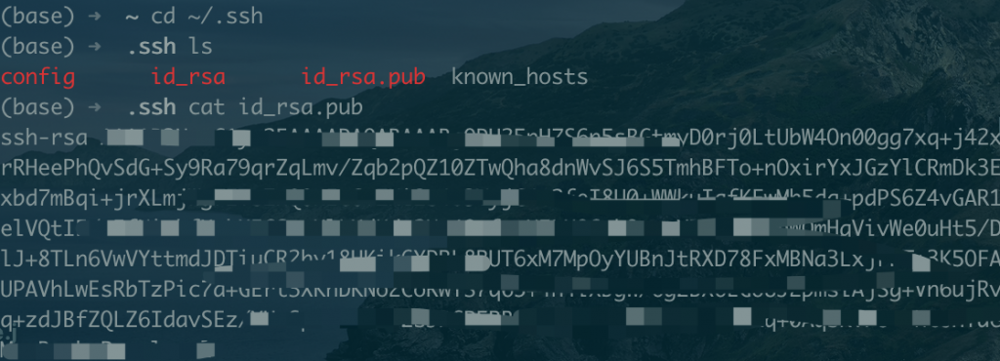

## 一、git常用命令

#### git clone
`git clone xxxx.git  `从github或者gitlab拉取项目代码
#### git config
`git config --global user.name` 配置开发者的用户名username<br/>
`git config --global user.email` 配置开发者的用户名user@email
#### git branch
创建、重命名、查看、删除项目分支，通过 Git 做项目开发时，一般都是在开发分支中进行，开发完成后合并分支到主干。<br>
`git branch daily/0.0.0`创建一个名为 daily/0.0.0 的日常开发分支，分支名只要不包括特殊字符即可。<br>
`git branch -m daily/0.0.0 daily/0.0.1 ` 如果觉得之前的分支名不合适，可以为新建的分支重命名，重命名分支名为 daily/0.0.1<br>
`git branch`通过不带参数的branch命令可以查看当前项目分支列表<br>
`git branch -d daily/0.0.1`如果分支已经完成使命则可以通过 -d 参数将分支删除，这里为了继续下一步操作，暂不执行删除操作
#### git checkout 切换分支
`git checkout daily/0.0.1 ` 切换到 daily/0.0.1 分支，后续的操作将在这个分支上进行
#### git status 查看文件变动状态
#### git add .  将本地开发环境代码添加到工作区
#### git commit 提交文件变动到版本库
`git commit -m "这里写提交的原因" ` 将工作区代码提交
#### git push 将本地的代码改动推送到服务器
`git push origin daily/0.0.1`origin 指代的是当前的git服务器地址，这行命令的意思是把 daily/0.0.1 分支推送到服务器
#### git pull 将服务器上的最新代码拉取到本地
`git pull origin daily/0.0.1`拉取远程daily/0.0.1分支的内容<br>
如果其它项目成员对项目做了改动并推送到服务器，我们需要将最新的改动更新到本地，这里我们来模拟一下这种情况。

进入Github网站的项目首页，再进入 daily/0.0.1 分支，在线对 README.md 文件做一些修改并保存，然后在命令中执行以上命令，它将把刚才在线修改的部分拉取到本地，用编辑器打开 README.md ，你会发现文件已经跟线上的内容同步了。 
如果线上代码做了变动，而你本地的代码也有变动，拉取的代码就有可能会跟你本地的改动冲突，一般情况下 Git 会自动处理这种冲突合并，但如果改动的是同一行，那就需要手动来合并代码，编辑文件，保存最新的改动，再通过 git add . 和 git commit -m 'xxx' 来提交合并。

#### git log 查看版本提交记录
`git log`通过该命令，我们可以查看整个项目的版本提交记录，它里面包含了提交人、日期、提交原因等信息

#### .gitignore 设置哪些内容不需要推送到服务器，这是一个配置文件
`touch .gitignore`<br>
.gitignore 不是 Git 命令，而在项目中的一个文件，通过设置 .gitignore 的内容告诉 Git 哪些文件应该被忽略不需要推送到服务器，通过以上命令可以创建一个 .gitignore 文件，并在编辑器中打开文件，每一行代表一个要忽略的文件或目录，如：<br>
```
demo.html
build/
```
以上内容的意思是 Git 将忽略 demo.html 文件 和 build/ 目录，这些内容不会被推送到服务器上


## 二、绑定SSH key
ssh key是一种github提供的通信方式，使用ssh key 可以部署入密码就访问github

检查ssh key是否存在
```
ls -al ~/.ssh

# lists the files in your .ssh directory, if thy exist.
```
生成shh key
```
ssh-keygen -t rsa -C "your_email@example.com"

# generating public/private rsa key.
# 一直按enter
```

然后找到.ssh/id_rsa.pub文件查看内容
```
cd ~/.ssh
cat id_rsa.pub
```
从ssh-rsa 开始复制，复制到最后，一定要复制全了



然后打开github 右上角头像--》Settings--》SSH and GPG keys--》(起一个辨识度高的名字，然后把刚才复制的key粘贴进去)New SSH key

<vssue :options="{locale:'zh'}"/>